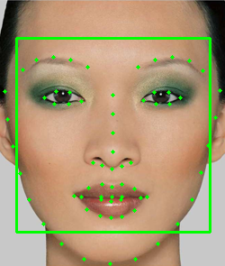

# Digital-Make-up-Transfer-and-Stylization
<table>
<tr>
<td>
 This is an implementation of paper “Digital Face Make up” by Dong Guo and Terence Sim except the implementation of WLS filter. In this we are using bilateral filter for noise reduction and smoothing.
</td>
</tr>
</table>

## Execution Way
python Main.py Images/subject.png Images/example.png

## AIM
To transfer the make-up from make-up image to non-make up image.

## Assumption
Working on same images dimensions and taking only single face in frame.

## Dataset for detecting control point
We are using 68 points trained face model data set which is creating 68 face control points on face and creating points on eyes, face, nose, mouth, lips. Dataset source is : https://github.com/davisking/dlib-models/blob/master/shape_predictor_68_face_landmarks.dat.bz2 

We are taking 2 images from user on which we are working. Steps that we followed to achieve the result:

### Step 1
To make control points on both of the faces, we are using dlib 68 control point face models database. As we know predictor takes only gray image, So after converting images into gray form, giving it to predictor and getting a face with 68 control points.

 
image

### Step 2
After marking control points on face, we are trying to make triangle with the help of these points using delaunay triangulation method.

image
image

### Step 3
After making triangle on both faces, we need to take out the selected region as a mask to perform warping.

image 
image

### Step 4
To transfer the make-up from one face to other face, we need to do it region wise and for this purpose, region should be aligned equally. So, we are using warping for face alignment.

image

### Step 5

Layer decomposition into face structure, skin detail and color using bilateral filter. We first obtained the face structure layer by using bilateral filter and getting final result.
-  Result of skin detail transfer is weighted sum of two skin layers of the subject and example image and according to paper we are taking delta_i=0 and delta_e=1.
-  Color transfer is using alpha blending of two-color layers of example and subject image. According to paper gamma is set to 0.8 for best results.
-  For highlight & shading transfer, we are using xDoG method to stylize the image.

image

